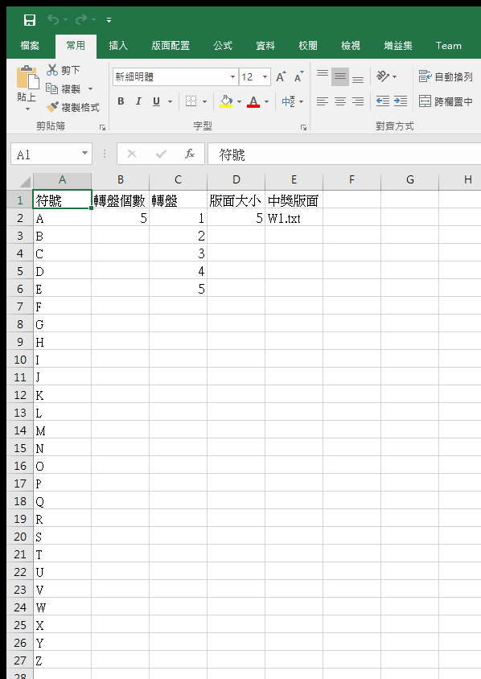
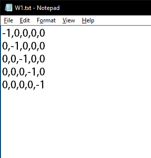
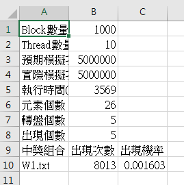
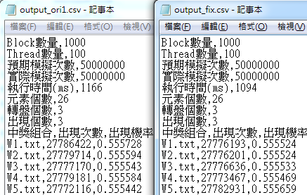
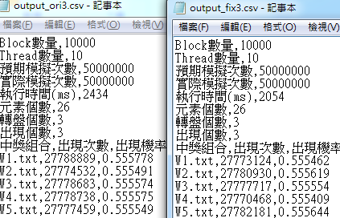

# CUDA-Permutation([Game-Simulation](https://github.com/Li-AnLin/Game-Simulation))

用CUDA模擬 [Slot machine](https://www.slotsmillion.com/en/games/) 的排列組合，並能夠模擬指定盤面的出現的機率。

## Input

定義符號和轉盤上的版面及數量，以及中獎盤面的檔案路徑。

[input.csv(暫定格式)](data/input.csv)

### Winning Set

用**符號的索引值**定義中獎的盤面

*-1 代表任何相同的圖案*

## Output

輸出中獎的機率。

[output.csv(暫定格式)](data/output.csv)

---------------------------------------------
# Debug紀錄
## 多個Thread同時使用同個Memory進行累加，導致累加錯誤。
參考https://www.ptt.cc/bbs/C_and_CPP/M.1271911923.A.2B8.html
1. 使用`atomicAdd(&x, 1)`代替`x += 1`。(效率較低，但比較好改)
2. 每個Thread使用的memory切乾淨，最後再用CPU算Sum。(效率較高)
### 比較效率(左:atomicAdd, 右: Thread切乾淨後Sum)

